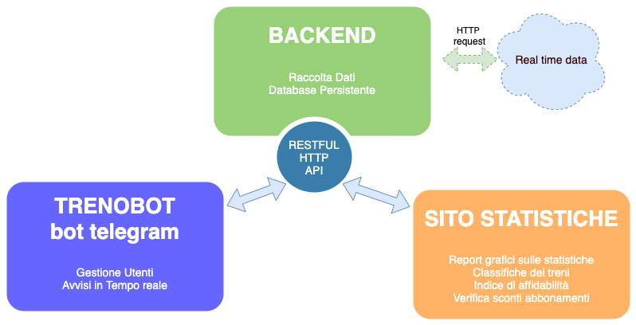

# High Level Architecture

L'applicazione é formata da tre servizi principali, un **backend**, che gestisce la raccolta dati e li immagazina in un database persistente, un **sito web** che visualizza le statistiche storiche e un **bot telegram** che aggiorna gli utenti in tempo reale.

I servizi comunicano tra loro attraverso API HTTP REST.

## Backend - REST API verso Trenitalia e DB persistenti

Il backend mette a disposizioni le API che estrapolano le informazioni relative ai treni dai siti ufficiali di Trenitalia.
Utilizza un database, dedicato alla raccolta dati per il sito web delle statistiche e altri ancora per la gestione della cache.

Per una visione più dettagliata relativa al backend è consigliabile consulatare la [relativa documentazione](../services/backend)

## Frontend - Sito web visualizzazione statistiche

Il frontend web esegue un'elaborazione grafica dei dati storici presenti sul backend per la visualizzazione di statistiche. Interagisce con il backend per l'estrazione dei dati necessari alla costruzione delle interfacce.

Per una visione più dettagliata relativa al frontend web è consigliabile consulatare la [relativa documentazione](../services/stats_website)

## Frontend - TrenoBot, bot Telegram

Il bot si interfaccia con l'utente gestendo avvisi real-time personalizzati e comunica con il backend attravero richieste HTTP.

Per una visione più dettagliata relativa al bot telegram è consigliabile consulatare la [relativa documentazione](../services/telegram-bot)

Documentazione pre-esistente del bot telegram: https://github.com/Fabrolly/TrenoBot

## Deployment

Il sistema è deployato su una istanza virtual di Google Cloud Engine.

